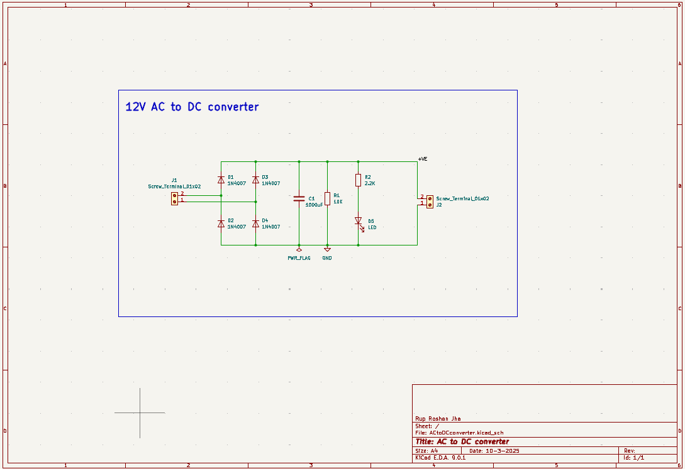

# 12V AC to DC Converter

This repository contains the design, schematic, and PCB layout for a simple **12V AC to DC Converter** project built using KiCad. This project is useful for students, hobbyists, and beginners in electronics who want to understand the basic principle of full-wave rectification and filtering.

## 🛠️ Project Overview

The project converts a 12V AC supply into a filtered DC output using a full bridge rectifier made with 1N4007 diodes, followed by a smoothing capacitor and LED indication.

### Features:
- Converts 12V AC to 12V DC (approximately)
- Full-wave bridge rectifier using 4 x 1N4007
- 1000μF capacitor for filtering
- LED indicator for DC output status
- Compact PCB layout
- Clearly labeled silkscreen components

---

## ⚡ Circuit Diagram

---

## 🧾 Components Used

| Component | Value/Part No. | Quantity |
|-----------|----------------|----------|
| Diode     | 1N4007         | 4        |
| Capacitor | 1000µF, 25V    | 1        |
| Resistor  | 10kΩ (R1)      | 1        |
| Resistor  | 2.2kΩ (R2)     | 1        |
| LED       | Red LED        | 1        |
| Screw Terminal | 2-pin     | 2        |
| PCB       | Custom-made    | 1        |

---

## 📐 PCB Layout

### Top View (Component Side)

### Bottom View (Solder Side)

---

## 📂 Files Included

- `schamatic.png` - Circuit diagram
- `front.png` - Top view of the PCB (assembled)
- `back.png` - Bottom copper layer of the PCB
- KiCad project files (if uploading) – `.kicad_pcb`, `.sch`, and BOM

---

## ✍️ Author

**Rup Roshan Jha**  
_ECE Student | Robotics & Embedded Systems Enthusiast_

---

## 📜 License

This project is open-source under the [MIT License](LICENSE).

---

## 🚀 Getting Started

1. Clone or download this repository.
2. Open the `.sch` and `.kicad_pcb` files in KiCad.
3. Review the schematic and layout.
4. Export the Gerber files to manufacture the PCB.
5. Solder the components as per the front image.
6. Power the AC side with 12V AC and get a filtered DC output.

---

## 🙋‍♂️ Support

If you like this project, give it a ⭐ and consider contributing or opening issues for improvements!
